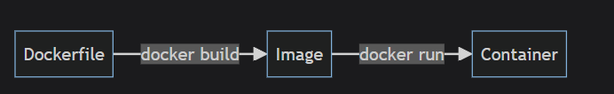
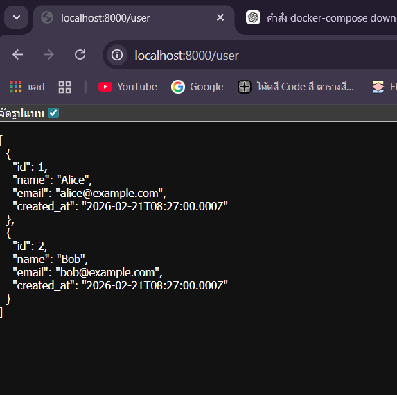

# node-server — สรุปโปรเจค
- สรุปสิ่งที่ได้ทำไปทั้งหมด
## 1. ได้ลองเขียน `Dockerfile` เพื่อ pake node-server



ref img: [mikelopster](https://docs.mikelopster.dev/c/basic/docker/basic)

- เพื่อให้เห็นภาพการทำงานของ Docker
- จากตอนแรกที่เราต้อง `npm init` เพื่อสร้าง server เอง 
- กลายเป็นเราสามารถ run container แทนได้

### วิธีทำ
1. Map port 
- ตอนนี้ docker เป็มเหมือนคอมจิ๋วที่รันอยู่ในเครื่อง
- ทีนี้เราต้อง map `localhost`:`docker` 
- port ภายนอก กับ port ภายใน ไม่จำเป็นต้องเปน port เดียวกันก็ได้
```
docker run -p <port ภายนอก>:<port ภายใน> <ชื่อ image>
```
**ตัวอย่าง**
```
docker run -p 8000:8000 node-server
```

2. `docker ps` 
- หลังจาก map port เมื่อมา `docker ps` ดูเราจะเจอ ชื่อ container
- เพื่อดู ชื่อ container (วรรคสุดท้าย)
- ในที่นี้คือ ชื่อ container `interesting_neumann`
 ```
PS C:\Users\nur> docker ps
CONTAINER ID   IMAGE         COMMAND                  CREATED          STATUS          PORTS                                         NAMES
e864ecfc6e8d   node-server   "docker-entrypoint.s…"   38 seconds ago   Up 36 seconds   0.0.0.0:8000->8000/tcp, [::]:8000->8000/tcp   interesting_neumann
```

3. `docker logs interesting_neumann`
- เพื่อให้ได้ port ถ้าทุกอย่างถูกต้องจะได้
```
Server running at http://localhost:8000/
```


## 2. ได้ลองเขียน `Docker compose` เพื่อเชื่อมกับฐานข้อมูล
### วิธีทำ
1. สร้างไฟล์ Docker compose
```
services:
  node-server:
    container_name: node-server # ตั้งชื่อ container (เหมือน --name)
    build: . # ตำแหน่ง dockerfile
    ports:
      - "8000:8000" # map port ออกมา เหมือน -p ใน docker run  

  db:
    image: mysql:latest
    container_name: db
    environment:
      MYSQL_ROOT_PASSWORD: root # กำหนด user ของ root mysql
      MYSQL_DATABASE: tutorial # กำหนด database เริ่มต้นของ mysql
    ports:
      - "3307:3306"
    volumes:
      - mysql_data_test:/var/lib/mysql # map โฟลเดอร์ /data ในเครื่อง host ไปยัง /var/lib/mysql ใน container เพื่อเก็บข้อมูลของ mysql ไว้ใน host

  phpmyadmin:
    image: phpmyadmin/phpmyadmin:latest
    container_name: phpmyadmin
    environment:
      PMA_HOST: db # ระบุ host ที่จะให้ phpmyadmin ไปจัดการ ซึ่งสามารถใส่เป็นชื่อ container name (db) ได้เลย
      PMA_PORT: 3306 # ระบุ port ของ Database
      PMA_USER: root # ระบุ user ของ Database
      PMA_PASSWORD: root # ระบุ password ของ Database
    ports:
      - "8080:80"
    depends_on:
      - db

volumes:
  mysql_data_test: # กำหนดชื่อ volume ที่ต้องการจะสร้าง
    driver: local

```

2. สร้างตารางใน phpmyadmin
```sql
CREATE TABLE users (
  id INT AUTO_INCREMENT PRIMARY KEY,
  name VARCHAR(100) NOT NULL,
  email VARCHAR(100) NOT NULL,
  created_at TIMESTAMP DEFAULT CURRENT_TIMESTAMP
);

-- เพิ่มข้อมูลทดสอบ
INSERT INTO users (name, email) VALUES 
('Alice', 'alice@example.com'),
('Bob', 'bob@example.com');
```

3. `docker-compose up -d --build` เพื่อรัน

4. `PS D:\ect\docker\example> docker logs node-server`
    - จะได้

    Server running at http://localhost:8000/

5. ไปที่ `http://localhost:8000/user`
    - จะต้องเจอข้อมูลในตาราง

    
